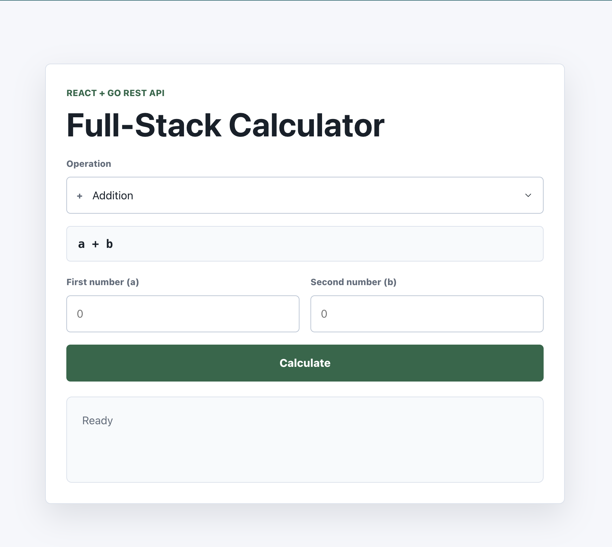
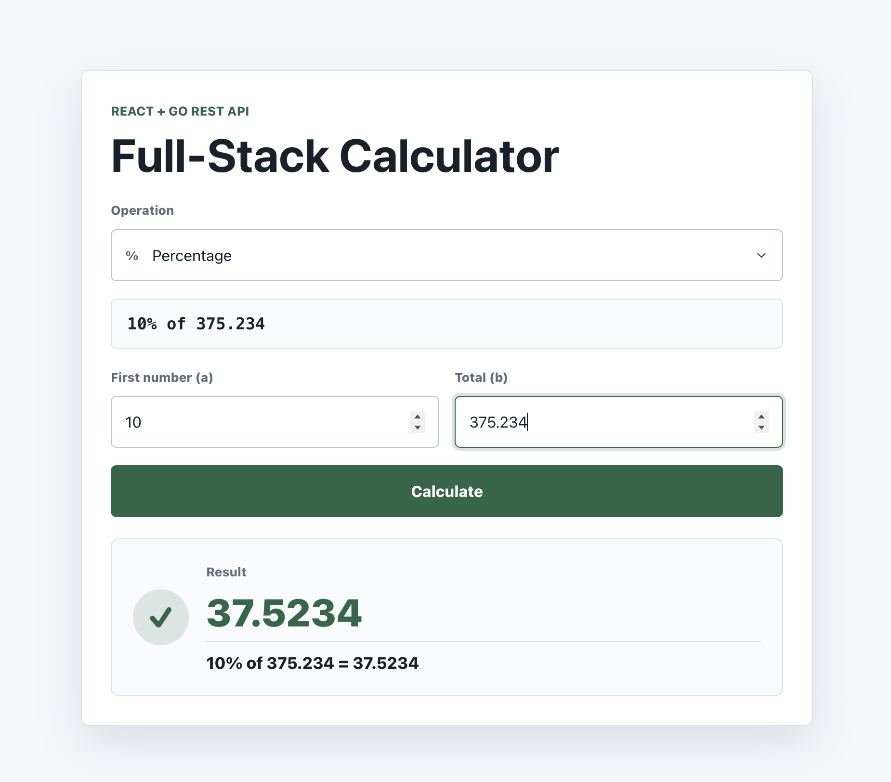
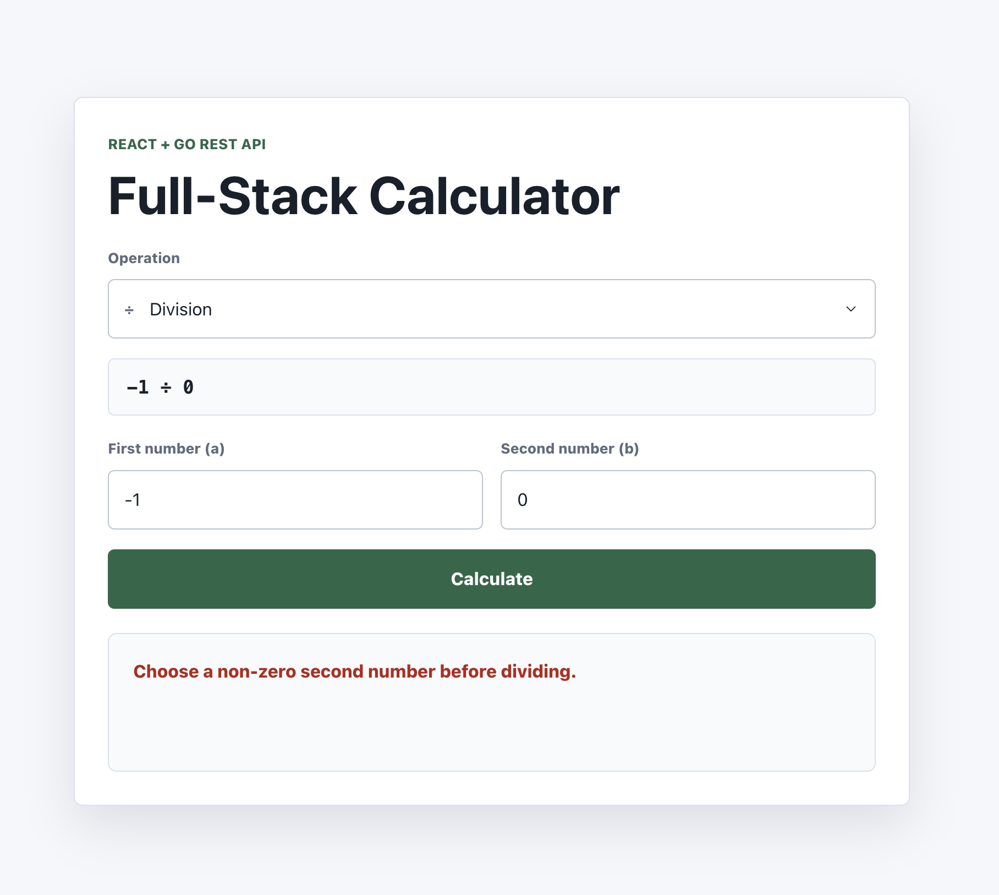

# Full-Stack Calculator

A full-stack calculator application built as a code assessment. The React frontend calls a Go REST API to perform basic and advanced arithmetic operations.

## Stack

- Frontend: React, TypeScript, Vite
- Backend: Go, REST API
- Testing: Vitest and React Testing Library for the frontend, Go unit tests for the backend

## Features

- Addition, subtraction, multiplication, and division
- Advanced operations: exponentiation, square root, and percentage
- Frontend input validation, loading, result, and error states
- Backend validation with JSON success and error responses
- Responsive calculator UI
- Unit tests for frontend behavior and backend calculation logic
- OpenAPI specification in `openapi.yaml`

## Screenshots

Initial calculator state:



Successful calculation:



Friendly error message:



## Project Structure

```txt
.
├── assets/
├── backend/
│   ├── cmd/server/
│   └── internal/
│       ├── api/
│       └── calculator/
├── frontend/
│   ├── src/
│   │   └── api/
│   └── package.json
├── openapi.yaml
├── PROMPTS.md
├── CHECKLIST.md
└── README.md
```

## Progress Tracking

See `CHECKLIST.md` for the step-by-step implementation plan and current project status.

## Setup

Install:

- Go 1.26 or newer for the backend
- Node.js 24 or newer for the frontend

If you use `nvm`, switch to the project Node.js version from the repository root:

```sh
nvm use
```

Install frontend dependencies:

```sh
cd frontend
npm install
```

## Backend

The backend includes:

- Calculator domain logic under `backend/internal/calculator`
- REST API handlers under `backend/internal/api`
- Server entrypoint under `backend/cmd/server`

Implemented operations:

- Addition
- Subtraction
- Multiplication
- Division
- Exponentiation
- Square root
- Percentage

Run the backend API from the backend directory:

```sh
cd backend
go run ./cmd/server
```

The API listens on port `8080` by default. Set `PORT` to use a different port:

```sh
PORT=9090 go run ./cmd/server
```

Run backend tests:

```sh
cd backend
go test ./...
```

Run backend tests with coverage:

```sh
go test ./... -cover
```

For detailed test output, use verbose mode:

```sh
go test -v ./... -cover
```

## Frontend

The frontend is a Vite React TypeScript app under `frontend/`.

Run the frontend development server:

```sh
cd frontend
npm run dev
```

The frontend calls `http://localhost:8080` by default. To use a different API URL, set `VITE_API_BASE_URL` when running the frontend:

```sh
VITE_API_BASE_URL=http://localhost:9090 npm run dev
```

Build the frontend:

```sh
npm run build
```

Run frontend tests:

```sh
npm run test
```

Run frontend tests with coverage:

```sh
npm run test:coverage
```

Run lint:

```sh
npm run lint
```

Preview the production build:

```sh
npm run preview
```

## Running The Full App

Start the backend first:

```sh
cd backend
go run ./cmd/server
```

In a second terminal, start the frontend:

```sh
cd frontend
npm run dev
```

Open the frontend at the URL printed by Vite, usually `http://localhost:5173`.

## Docker

Docker support is optional. To run the full stack with Docker Compose:

```sh
docker compose up --build
```

Open the frontend at `http://localhost:5173`. The backend API is exposed at `http://localhost:8080`.

Stop the containers:

```sh
docker compose down
```

## API Examples

The API contract is documented in `openapi.yaml`. Keep that file in sync whenever endpoints, request fields, response shapes, or error messages change.

Health check:

```sh
curl http://localhost:8080/health
```

Response:

```json
{
  "status": "ok"
}
```

Calculate addition:

```sh
curl -X POST http://localhost:8080/api/calculate \
  -H "Content-Type: application/json" \
  -d '{"operation":"add","a":10,"b":5}'
```

Response:

```json
{
  "operation": "add",
  "result": 15
}
```

Calculate square root:

```sh
curl -X POST http://localhost:8080/api/calculate \
  -H "Content-Type: application/json" \
  -d '{"operation":"sqrt","a":25}'
```

Response:

```json
{
  "operation": "sqrt",
  "result": 5
}
```

Example error response:

```sh
curl -X POST http://localhost:8080/api/calculate \
  -H "Content-Type: application/json" \
  -d '{"operation":"divide","a":10,"b":0}'
```

Response:

```json
{
  "error": "division by zero"
}
```

Supported operation values:

- `add`
- `subtract`
- `multiply`
- `divide`
- `power`
- `sqrt`
- `percentage`

## Design Decisions

- Keep calculation logic separate from HTTP handlers so it can be tested directly.
- Use the backend as the source of truth for validation and edge cases.
- Keep the frontend API client isolated from UI components for maintainability.
- Keep the API contract operation-based instead of implementing expression parsing.
- Use hand-written frontend API types for this small API, while keeping `openapi.yaml` as the documented contract.
- Keep all evaluation documentation in the root README so setup, API usage, and design rationale are easy to find.
- Prioritize clarity and testability over unnecessary framework complexity.

### Operation-Based API

The calculator performs one operation per API request instead of parsing full mathematical expressions. For example, the frontend sends an explicit operation such as `divide` with operands `a` and `b`.

This keeps the API contract simple, predictable, and easy to validate. It also makes edge cases like division by zero, missing operands, unsupported operations, and square roots of negative numbers straightforward to test.

Expression parsing, operator precedence, and multi-step formulas are intentionally out of scope for this assessment. The requested operation list maps cleanly to explicit API operations, which keeps the implementation focused on full-stack structure, validation, and maintainability.

### OpenAPI And TypeScript Types

The API contract is documented in `openapi.yaml`. The frontend currently uses small hand-written TypeScript request and response types in `frontend/src/api/types.ts`.

For this assessment, hand-written types keep the implementation simple and readable. If the API grows, generated TypeScript types from `openapi.yaml` would be a reasonable next step.

## Assumptions

- The calculator runs one operation at a time and does not parse free-form mathematical expressions.
- Operand `b` is required for every operation except square root.
- The backend returns API errors as JSON with an `error` field.
- Docker support is optional for this assessment; local Go and Node.js commands remain the primary development workflow.

## Test Coverage

Backend coverage is reported with:

```sh
cd backend
go test ./... -cover
```

Frontend coverage is reported with:

```sh
cd frontend
npm run test:coverage
```

## AI Prompts Used

Initial planning and implementation were assisted with AI tooling. The prompts used for assessment transparency are recorded in `PROMPTS.md`.
